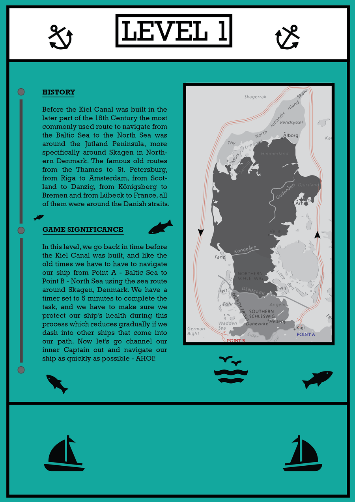

<h1 align="center">
  Kiel Canal Game
</h1>

<div align="center" style="margin-bottom:30px">

<a href="https://kiel-canal.simarmannsingh.com">
  <picture>
    
  </picture>
</a>


[](https://app.netlify.com/sites/kiel-canal/deploys)

</div>

---

This repository contains source code for the Kiel Canal Game, which was created as part of a project to be displayed to open public at the Muesem.

This game is designed to showcase the significance and evolution of Kiel Canal, also keeping in mind the audience of the game, which typically would be children under the age of 13. The Game provides a brief overview of the operation and environment effect of ancient Kiel (Schleswig-Holstein) waterways and how the creation of Kiel Canal has revolutionarised the waterways along with saving the environment. The resources saved on a daily basis are tremendous. Kiel Canal is one of the most busiest waterways in the entire Northern Europe even today.


## Credits
- Big shoutout to [@AnthonyNoronha](https://github.com/anthonynoronha) for helping create the Map tiles and all the graphics required for the Game. Without his help, the game would never have existed in the first place.

## Help Menu
Press the `Shift` key during the game to open up the Map.

## How to play

To play the game, you simply have to visit the link mentioned on the right side of the page and the game should load in your web browser. Game should work flawlessly on almost all of the modern web browser. If any problem is encountered, please use the issues tab to create a `issue` and the developer will respond within 24-48 hrs.

You can use arrow keys to navigate the ship and find your way through the map, reaching the goal within time limit.

## Development

The game is currently under development and is to be released with an MIT licence. This means anyone is free to modify and use the source code of the project in their own commercial or non-commercial projects without written permission. The copyright notice and permission notice shall be included in all copies or substantial portions of the Software.

## Requirements

To run the project on your machine, You'll need
- [Node.js](https://nodejs.org/en/)
- [npm](https://www.npmjs.com/)
- [Parcel](https://parceljs.org/)

The KielCanal game is created using the `Phaser3` + Parcel template created by [*ourcade*](https://github.com/ourcade/phaser3-parcel-template).

Install `Node.js` and `npm` using [`nvm`](https://github.com/nvm-sh/nvm):

```shell
nvm install 12.18.2
```

Replace 'node' with 'latest' for `nvm-windows`.

## Getting Started

Clone this repository to your local machine:

    git clone https://github.com/simarmannsingh/Kiel-canal.git

You might need to install all the dependencies first and then you can run the software
To do so,

    cd KielCanal
    npm install

This should install all the dependencies. Then, start the development server using

    npm run dev

To run a production build:

    npm run build & npm start

Production files will be placed in the `dist` folder. Then upload those files to a web server.

## Project Structure

```
    .
    ├── dist
    ├── node_modules
    ├── public
    ├── src
    │   ├── Anims
    │   │   ├── CharacterAnims.ts
    │   │   ├── EnemyAnims.ts
    │   ├── Enemies
    │   │   ├── Enemies.ts
    │   ├── scenes
    │   │   ├── Game.ts
    │   │   ├── Preloader.ts
    │   ├── index.html
    │   ├── main.js
    ├── package.json
```

## Screenshots

#### Background


#### Rule of the game


#### Level 1 Introduction


#### Level 1 map


#### Level 2 Introduction


#### Level 2 map


## TODO:
- Countdown timer
- Finish Line
- UI buttons for Sound controls
- Replay or Restart Mission button
- Collecting chest coins
- Saving Highscore
- User Accounts /  Guest Accounts
- Multiplayer options


## License

[MIT License](https://github.com/simarmannsingh/Kiel-canal/blob/master/LICENSE)
